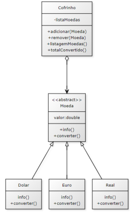

# Sistema "Cofrinho de Moedas"

Este é um projeto desenvolvido como parte da disciplina de Programação Orientada a Objetos, ministrada pelo Prof. Leonardo Gomes, Dr. O objetivo do trabalho é implementar um pequeno sistema em Java que emula um "Cofrinho de Moedas".

## Objetivo

O objetivo principal do sistema é permitir que o usuário realize as seguintes ações:

1. Adicionar moedas de diferentes valores e países em seu cofrinho.
2. Remover moedas específicas do cofrinho.
3. Listar todas as moedas que estão dentro do cofrinho.
4. Calcular quanto dinheiro existe no cofrinho, convertido para Real.

O trabalho tem como foco avaliar o bom uso dos conceitos de herança e polimorfismo. O projeto deve incluir uma classe principal, além das classes descritas no diagrama UML fornecido.

## Diagrama UML

A classe `Cofrinho` possui um atributo que representa uma coleção de moedas. Essa coleção é uma classe mãe abstrata chamada `Moedas`, que possui subclasses específicas para Dólar, Euro, Real, entre outras. A coleção de moedas pode ser implementada utilizando uma estrutura de dados como ArrayList.

## Responsável

Aluno: Emanuel Marinho

## Status do projeto

Em andamento

